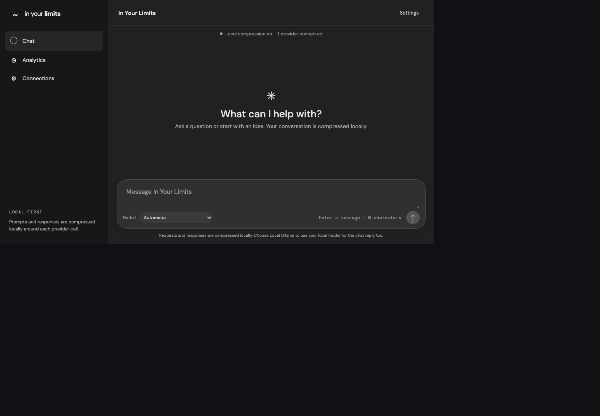
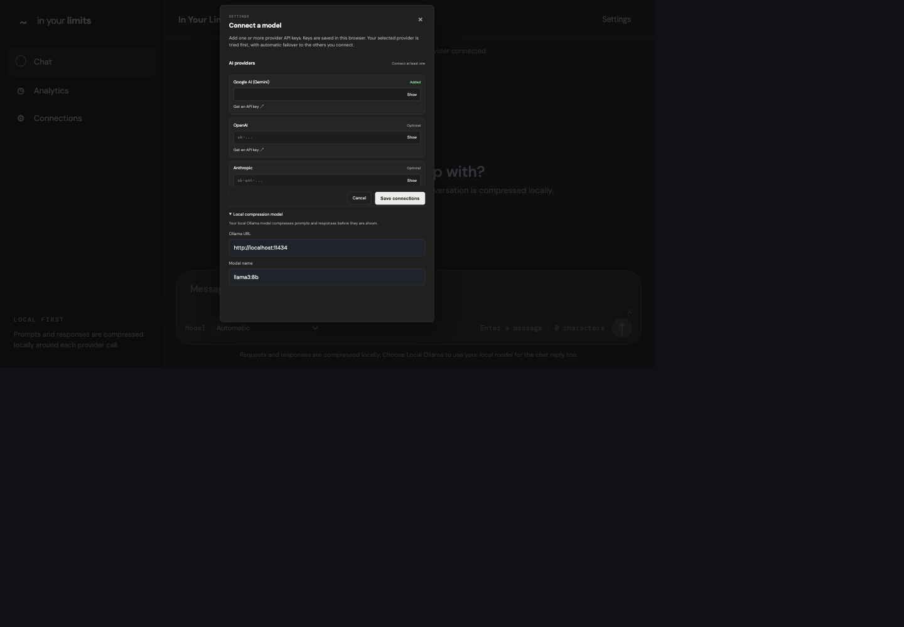
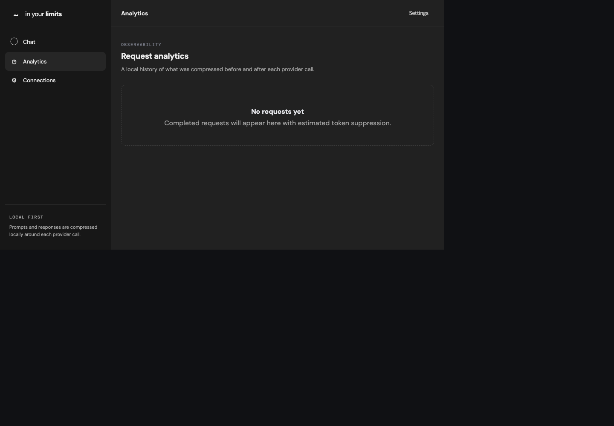

# In Your Limits

In Your Limits is a local-first chat gateway for using cloud AI providers alongside a local Ollama model. It compresses each prompt with Ollama before sending it to a selected provider, compresses the reply before displaying it, and can retry a failed request with another configured route.

> **Local-first does not mean cloud-free.** If you select a cloud provider, the compressed prompt and conversation context are sent to that provider. Choose **Local Ollama** to keep the chat generation on your machine.

## App walkthrough

### 1. Chat and choose a model

The Chat screen is where you enter prompts and choose **Automatic**, a specific cloud provider, or **Local Ollama**. The status above the composer shows whether Ollama is available for local prompt/response compression.



### 2. Configure Connections

Open **Connections** in the sidebar or **Settings** in the header. Add keys for the cloud providers you want to use; keys are optional if you select Local Ollama. Expand **Local compression model** to configure the Ollama URL and model. The default model is `llama3:8b`.



### 3. Review Analytics

After a successful request, Analytics records the provider used, the original and compressed request/response, estimated tokens suppressed, and available conversation-memory information. The example below shows the empty state before the first request.



## How a chat request works

1. The browser sends the selected route, prompt, provider keys, Ollama settings, and conversation ID to the local API.
2. Ollama rewrites the new user prompt compactly. A local token estimate checks the conversation against the candidate model's context budget.
3. For each provider attempt, the gateway prepares the conversation context. When the context needs to be shortened, Ollama summarizes older turns while recent messages are retained.
4. The gateway sends the context to the selected provider or tries the next available provider if the request fails. The successful reply is saved to the conversation.
5. Ollama compresses the reply before it is returned to the browser, where it appears in Chat and Analytics.

Conversation history is kept by the API server in memory. It is preserved across provider retries and across requests in the running server, but is lost when the server restarts. The context-size checks use estimates and configured model limits, so they are approximate.

## Provider routing and failover

- **Automatic** tries configured cloud providers in this order: Google Gemini, OpenAI, Anthropic, then Local Ollama.
- **Explicit provider** tries the selected provider first, then the other configured cloud providers, then Local Ollama.
- Providers without an API key are skipped. Local Ollama uses the configured model and does not need a cloud key.
- A provider error, authentication failure, quota/rate limit, or recognized context/output-limit error triggers an attempt at the next available route.
- The response and notice identify the provider that answered. If every route fails, the error includes the attempted provider failures.

Ollama must be running even for cloud-provider chat, because it is used for prompt and response compression. If Ollama is offline, the app cannot prepare or display a compressed request.

## Requirements

- Node.js 20.19+ or 22.12+
- npm
- [Ollama](https://ollama.com/) running locally
- A cloud-provider API key only if you want to use a cloud route

## Run locally

```bash
ollama serve
ollama pull llama3:8b
npm install
cp .env.example .env
npm run dev
```

Open <http://localhost:5174>. Open **Connections**, enter an Ollama URL and model if they differ from the defaults, and save. Add one or more cloud-provider API keys if needed. Choose **Local Ollama** to run chat locally, choose a specific cloud provider to prefer it, or leave the selector on **Automatic** for fallback routing.

The development API listens on `API_PORT` (default `8787`); Vite proxies `/api` requests to that port. The frontend listens on `VITE_PORT` (default `5174`). If you override `API_PORT`, export it before starting `npm run dev` so the Node server and Vite proxy use the same port. `VITE_PORT` can be set in `.env` or exported in the shell. The Ollama URL can be configured in Connections; the server-side default is `http://localhost:11434`.

## Test provider failover

1. Ensure Ollama is running and its configured model is installed.
2. In **Connections**, configure valid keys for two cloud providers and save.
3. Select one of those cloud providers in the Chat model selector.
4. Temporarily replace the selected provider's key with an invalid value, then save Connections.
5. Send a prompt. The request should fail over to the other configured provider; the notice above the chat shows which provider answered.
6. Restore the valid key when finished.

You can also test local-only chat by selecting **Local Ollama**. No cloud key is required for that route.

## Troubleshooting

- **“Local compression offline”**: start Ollama (`ollama serve`), check that the URL in Connections is reachable, and use **Retry Ollama**.
- **Model not found**: install the configured model with `ollama pull llama3:8b`, or change the model name in Connections to one already installed.
- **Empty/non-JSON API response or a 502**: confirm the API server is running and that `API_PORT` matches the Vite proxy configuration; the defaults are 8787 and 5174 respectively.
- **All providers failed**: check the API keys, provider quota/rate limits, connectivity, and whether the requested context fits the model.

## Project map

- `src/` — React chat interface, Connections settings, Analytics, and browser-side storage.
- `server.js` — local HTTP API, conversation memory, context budgeting/summarization, compression, and provider routing.
- `vite.config.js` — frontend dev server and `/api` proxy configuration.
- `docs/screenshots/` — screenshots used in this walkthrough.

## Security and privacy

Provider API keys are stored in this browser's `localStorage` and sent to the local API server when a request is made. Treat access to the browser profile and local machine accordingly. Cloud providers receive prompts and context when their route is used. This project is intended for local development; a deployed service should add authentication, access controls, and server-side secret management.
